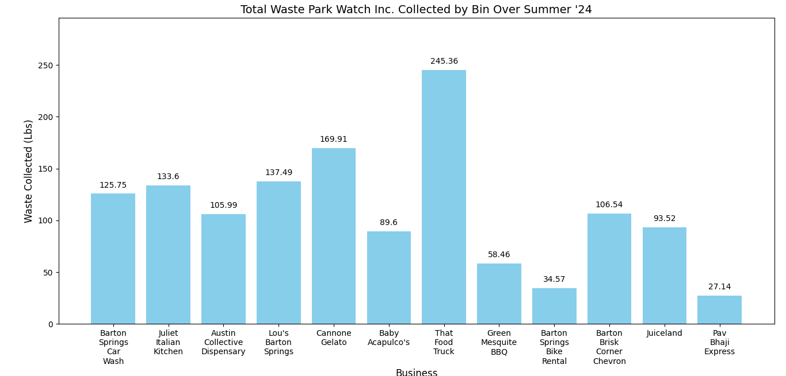

# austin-litter-visualization
This is a data visualization and analysis project built in Python using Pandas and Matplotlib as part of my internship with Park Watch Inc., a nonprofit dedicated to cleaning up Barton Springs in Austin, TX. The project was designed to identify which businesses near Barton Springs produced the most litter and help the organization prioritize cleanup efforts.

Built using Python in Jupyter Notebook with Pandas and Matplotlib

Cleaned raw data from waste bins and grouped by business name

Calculated total pounds of waste collected per bin over summer 2024

Created a clear bar graph to visualize and compare waste output by location

Found That Food Truck was the top contributor with 245+ lbs of waste

Data helped Park Watch target high-trash areas and adjust bin placement

Graph includes labeled bars for clarity and insight presentation

Project was shared with Park Watch's leadership to improve operational planning

Focused on clear storytelling and real-world community impact through data

Designed to be accessible to both technical and non-technical audiences

This project is a direct example of how data analysis can support nonprofit impact work, combining technical skills with mission-driven results.

